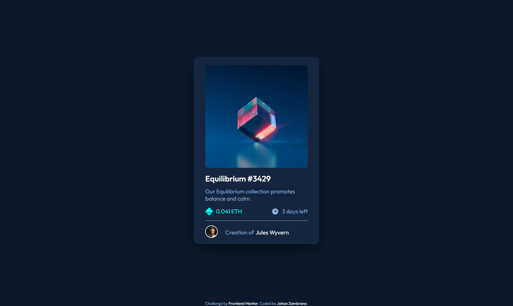
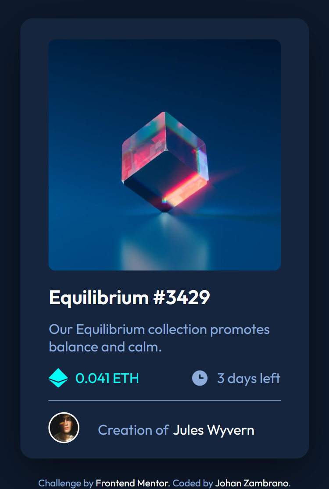

# Frontend Mentor - NFT preview card component solution

This is a solution to the [NFT preview card component challenge on Frontend Mentor](https://www.frontendmentor.io/challenges/nft-preview-card-component-SbdUL_w0U). Frontend Mentor challenges help you improve your coding skills by building realistic projects. 

## Table of contents

- [Overview](#overview)
  - [The challenge](#the-challenge)
  - [Screenshot](#screenshot)
  - [Links](#links)
- [My process](#my-process)
  - [What are you most proud of, and what would you do differently next time?](#what-are-you-most-proud-of-and-what-would-you-do-differently-next-time)
  - [Built with](#built-with)
  - [What I learned](#what-i-learned)
  - [Continued development](#continued-development)
  - [Useful resources](#useful-resources)
- [Author](#author)

## Overview

### The challenge

Users should be able to:

- View the optimal layout depending on their device's screen size
- See hover states for interactive elements

### Screenshot

#### Desktop View


#### Mobile View


### Links

- Solution URL: [GitHub Repository](https://github.com/jazs790715/NFT-preview-card-component)
- Live Site URL: [https://jazs790715.github.io/NFT-preview-card-component/](https://jazs790715.github.io/NFT-preview-card-component/)

## My process

### What are you most proud of, and what would you do differently next time?

I'm most proud of successfully implementing the hover overlay effect on the NFT image. Getting the absolute and relative positioning to work correctly, along with the smooth opacity transition, was challenging but rewarding. The cyan overlay with the eye icon appears seamlessly when hovering, exactly as intended in the design.

What I would do differently next time:
- **Better semantic HTML structure**: I would use more descriptive class names and possibly implement BEM methodology for better code organization
- **Accessibility first**: Add proper `alt` attributes, ARIA labels, and ensure the interactive elements are keyboard accessible from the start
- **CSS organization**: Separate the CSS into different sections (variables, base styles, components, utilities) for better maintainability
- **Testing earlier**: Test the responsive design on actual devices earlier in the development process, not just in browser dev tools

### Built with

- Semantic HTML5 markup
- CSS custom properties
- Flexbox
- Mobile-first workflow
- CSS positioning (absolute and relative)
- CSS transitions and hover effects

### What I learned

During this project, I reinforced several important CSS concepts and learned new techniques:

**1. Overlay effects with absolute positioning**

I implemented an interactive overlay that appears on hover using absolute positioning. This required careful handling of the parent-child relationship:

```html
<div class="ntf-image">
  
  <div class="overlay-icon">
    
  </div>
</div>
```

```css
.ntf-image {
  position: relative;
  width: 100%;
  border-radius: 0.5rem;
  overflow: hidden;
}

.overlay-icon {
  position: absolute;
  inset: 0;
  background-color: hsla(178, 100%, 50%, 0.5); 
  display: flex;
  justify-content: center;
  align-items: center;
  opacity: 0; 
  transition: opacity 0.3s ease-in-out;
}

.ntf-image:hover .overlay-icon {
  opacity: 1;
  cursor: pointer;
}
```

**2. CSS Custom Properties for theming**

I used CSS variables to maintain a consistent color scheme throughout the project:

```css
:root {
  --Blue-500 : hsl(215, 51%, 70%);
  --Cyan-400 : hsl(178, 100%, 50%);
  --Blue-950 : hsl(217, 54%, 11%);
  --Blue-900 : hsl(216, 50%, 16%);
  --Blue-800 : hsl(215, 32%, 27%);
  --White    : hsl(0, 0%, 100%);
}
```

**3. Responsive design with `min()` function**

I used the CSS `min()` function to create fluid, responsive layouts:

```css
main {
  width: min(87.5%, 22rem);
}
```

**4. Smooth hover transitions**

I implemented subtle hover effects that enhance the user experience:

```css
.title:hover {
  color: var(--Cyan-400);
  cursor: pointer;
}
```

### Continued development

In future projects, I want to continue focusing on:

- **Advanced CSS positioning**: Further refine my understanding of absolute and relative positioning, especially when creating complex overlays and layered designs
- **Accessibility improvements**: Add proper ARIA labels and ensure keyboard navigation works correctly for interactive elements
- **CSS animations**: Explore more complex animation techniques beyond simple transitions
- **Component-based architecture**: Potentially rebuild this using a framework like React to create reusable components

### Useful resources

- [MDN - CSS Position](https://developer.mozilla.org/en-US/docs/Web/CSS/position) - This helped me understand the nuances of absolute and relative positioning for the overlay effect
- [CSS Tricks - A Complete Guide to Flexbox](https://css-tricks.com/snippets/css/a-guide-to-flexbox/) - Essential reference for creating the card layout
- [MDN - CSS inset](https://developer.mozilla.org/en-US/docs/Web/CSS/inset) - Learned about the shorthand property for positioning the overlay
- [Web.dev - HSL Color](https://web.dev/learn/css/color/) - Helped me understand and work with HSL color values effectively

## Author

- GitHub - [@jazs790715](https://github.com/jazs790715)
- Frontend Mentor - [@jazs790715](https://www.frontendmentor.io/profile/jazs790715)
